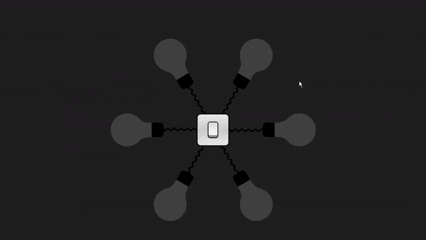

# Light Bulb Animation



A creative and interactive light bulb animation with a switch, built using HTML, CSS, and JavaScript.

## Table of Contents

- [Overview](#overview)
- [Features](#features)
- [Live Preview](#live-preview)
- [Installation](#installation)
- [Usage](#usage)
- [Contributing](#contributing)
- [License](#license)

## Overview

This project showcases a visually appealing light bulb animation with a switch. The animation is achieved through a combination of HTML, CSS, and JavaScript, providing an interactive experience for users.

## Features

- Realistic light bulb animation.
- Interactive switch with a click sound effect.
- Responsive design for various screen sizes.

## Live Preview

You can view a live preview of the light bulb animation [here](https://light-bulb-animation-by-manishkmr49.netlify.app/).

## Installation

1. Clone the repository to your local machine:

   ```bash
   git clone https://github.com/manishkmr49/Light-Bulb-Animation.git

Navigate to the project directory:

cd Light-Bulb-Animation

##License
This project is licensed under the MIT License.

Feel free to customize this Markdown code based on additional details about your project or specific instructions for users.

